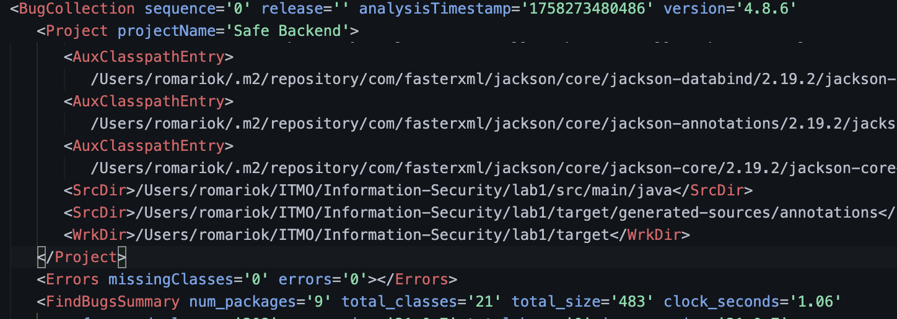
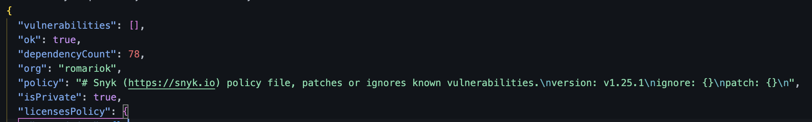
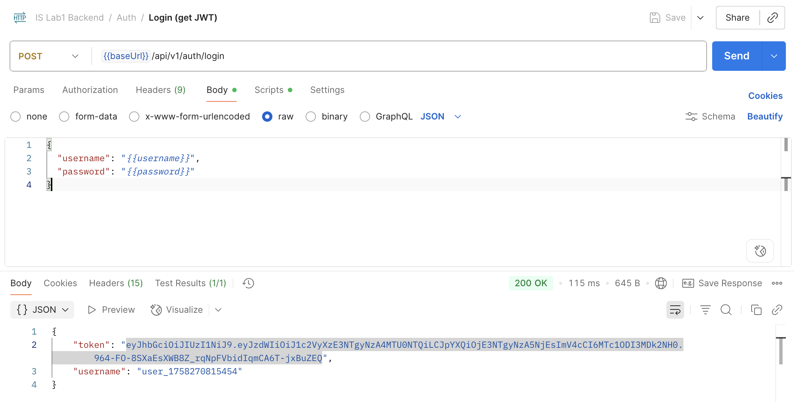
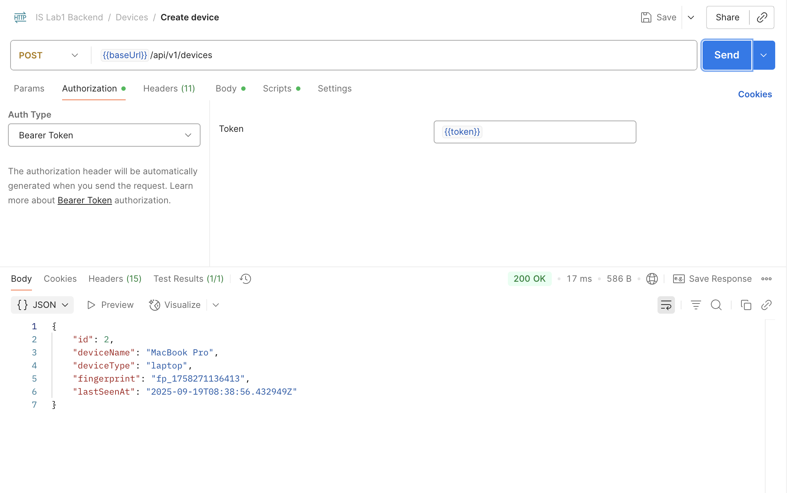
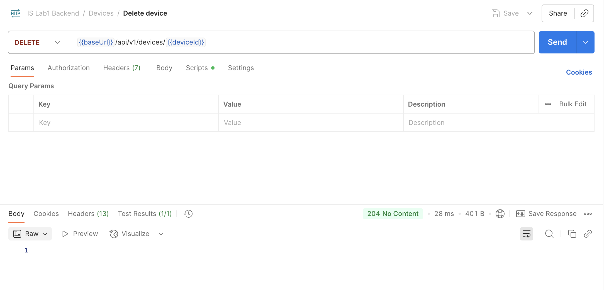
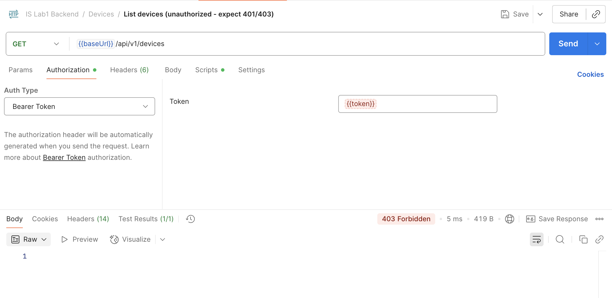
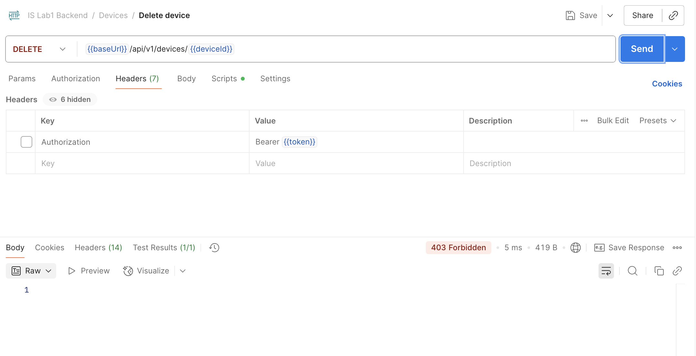

## Safe Backend — Лабораторная 1 (Информационная безопасность)

## Описание проекта

REST API для управления устройствами пользователя с соблюдением базовых мер информационной безопасности:
- **аутентификация**: JWT (HS256), пароли с BCrypt
- **авторизация**: доступ к API только с `127.0.0.1/::1`, неизвестные пути запрещены
- **ввод/валидация**: `jakarta.validation` для DTO
- **персистентность**: Spring Data JPA (подготовленные выражения → защита от SQLi)
- **HTTP-защита**: безопасные заголовки, строгий CORS, stateless-сессии, CSRF отключён для REST

## API

- **Базовый URL**: `http://localhost:8081`
- **Ограничение по IP**: доступ к `/api/v1/auth/**` и `/api/v1/devices/**` только с `127.0.0.1` и `::1` (иначе `403 Forbidden`).
- **Аутентификация**: передавайте токен в заголовке `Authorization: Bearer <JWT>`.

### Аутентификация

- **POST /api/v1/auth/register** — регистрация
  - Тело (JSON):
    ```json
    {
      "username": "alice",
      "password": "password123",
      "email": "alice@example.com"
    }
    ```
  - Ответ (200):
    ```json
    { "token": "<JWT>", "username": "alice" }
    ```

- **POST /api/v1/auth/login** — вход
  - Тело (JSON):
    ```json
    { "username": "alice", "password": "password123" }
    ```
  - Ответ (200):
    ```json
    { "token": "<JWT>", "username": "alice" }
    ```

Пример вызовов (curl):
```bash
# Register
curl -s -X POST http://localhost:8081/api/v1/auth/register \
  -H 'Content-Type: application/json' \
  -d '{"username":"alice","password":"password123","email":"alice@example.com"}'

# Login
TOKEN=$(curl -s -X POST http://localhost:8081/api/v1/auth/login \
  -H 'Content-Type: application/json' \
  -d '{"username":"alice","password":"password123"}' | jq -r .token)
```

### Устройства пользователя (требуется JWT)

- **GET /api/v1/devices** — список устройств текущего пользователя
  - Ответ (200): массив `UserDeviceResponseDTO`

- **POST /api/v1/devices** — создать устройство
  - Тело (JSON):
    ```json
    {
      "deviceName": "Alice iPhone",
      "deviceType": "mobile",
      "fingerprint": "1b4b2a0e8f6c4d7a9c0f3e2d1a5b6c7d"
    }
    ```
  - Ответ (200): `UserDeviceResponseDTO`

- **PUT /api/v1/devices/{id}** — обновить устройство по id
  - Тело (JSON): поля как для создания (без изменения fingerprint)
  - Ответ (200): `UserDeviceResponseDTO`

- **DELETE /api/v1/devices/{id}** — удалить устройство по id
  - Ответ: `204 No Content`

Примеры вызовов (curl):
```bash
# List
curl -s http://localhost:8081/api/v1/devices \
  -H "Authorization: Bearer $TOKEN"

# Create
curl -s -X POST http://localhost:8081/api/v1/devices \
  -H 'Content-Type: application/json' \
  -H "Authorization: Bearer $TOKEN" \
  -d '{"deviceName":"Alice iPhone","deviceType":"mobile","fingerprint":"1b4b2a0e8f6c4d7a9c0f3e2d1a5b6c7d"}'

# Update
curl -s -X PUT http://localhost:8081/api/v1/devices/1 \
  -H 'Content-Type: application/json' \
  -H "Authorization: Bearer $TOKEN" \
  -d '{"deviceName":"Alice iPhone (new)","deviceType":"mobile"}'

# Delete
curl -s -X DELETE http://localhost:8081/api/v1/devices/1 \
  -H "Authorization: Bearer $TOKEN"
```

Валидация входных данных (основные ограничения):
- `username`: 3–50 символов; `password`: минимум 6 символов; `email`: корректный адрес
- `deviceName`: ≤100; `deviceType`: ≤50; `fingerprint`: 16–128 символов, все поля обязательны


## Реализованные меры защиты

### Аутентификация и авторизация
- **JWT (HS256)**: генерация и валидация токенов (подпись секретным ключом, срок жизни из `JWT_EXPIRATION`).
- **Безопасный секрет**: берётся из `JWT_SECRET`; при слабом/пустом значении генерируется криптографически стойкий ключ на запуск (для разработки).
- **Stateless-сессии**: хранение контекста только в JWT, без серверной сессии.
- **Пароли**: хэшируются `BCryptPasswordEncoder`.
- **Доступ только с localhost**: `/api/v1/auth/**` и `/api/v1/devices/**` разрешены только с `127.0.0.1`/`::1`.
- **Запрет всего прочего**: `anyRequest().denyAll()`.

### Защита от SQL Injection (SQLi)
- **Spring Data JPA**: используются репозитории и методы с параметрами (`findByUsername`, `findByIdAndUsername`, `existsByFingerprint` и др.),
  что транслируется в подготовленные выражения Hibernate — без конкатенации SQL-строк.
- **Typed DTO + валидация**: ограничивает типы/диапазоны и исключает произвольные SQL-фрагменты во входных данных.

### Защита от XSS и связанных рисков
- **Контент только JSON** на стороне сервера; нет рендеринга HTML.
- **Безопасные заголовки**: `X-Content-Type-Options=nosniff`, `X-Frame-Options=DENY`, `Referrer-Policy=no-referrer`.
- **Валидация входа**: длины и формат полей предотвращают экстремальные значения.

### CSRF и CORS
- **CSRF отключён** для stateless REST с токенами в `Authorization`-заголовке.
- **CORS ограничён**: разрешены только источники `http://localhost:*`, методы `GET, POST, PUT, DELETE`, произвольные заголовки; `allowCredentials=true`.


## SAST/SCA отчёты (CI/CD)

- **SAST (SpotBugs)** — отчёт и скриншот:
  - Скриншот: 
  - Отчёты: [`docs/spotbugsXml.xml`](docs/spotbugsXml.xml), [`docs/spotbugsXml1.xml`](docs/spotbugsXml1.xml)

- **SCA (Snyk)** — отчёт и скриншот:
  - Скриншот: 
  - Отчёты: [`docs/snyk-report.json`](docs/snyk-report.json), [`docs/snyk-report-new.json`](docs/snyk-report-new.json)

Скриншоты соответствуют выполненным пайплайнам в разделе GitHub Actions репозитория.


## Postman коллекция
- Коллекция: `docs/IS-Lab1.postman_collection.json`
- Окружение: `docs/IS-Lab1.postman_environment.json`
 - Скриншоты (Postman):
   - Логин: 
   - Авторизованный POST /api/v1/devices: 
   - Авторизованное DELETE /api/v1/devices/{id}: 
   - Неавторизованный GET /api/v1/devices: 
   - Неавторизованное DELETE /api/v1/devices/{id}: 

